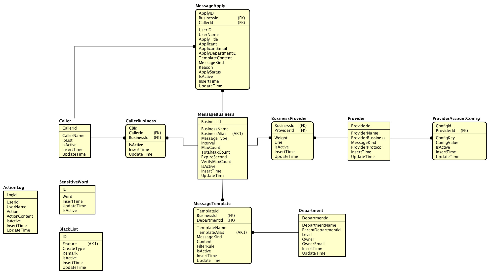
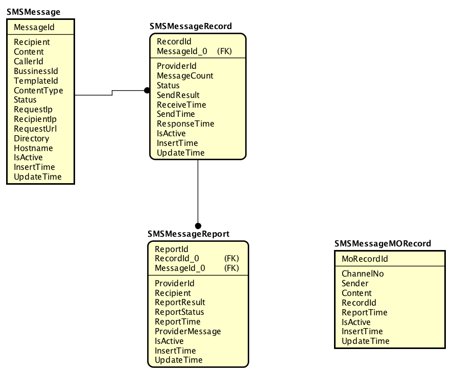
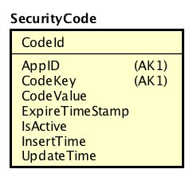
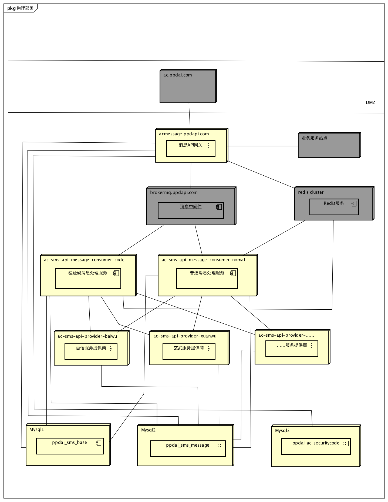

# 拍拍贷短信中台项目

------

## 项目结构说明

```Root
|ppdai-sms
 |--ac-sms-admin-contract(短信管理后台契约工程)
 |--ac-sms-api(短信API服务工程)
   |--ac-sms-api-admin(短信后台管理服务)
   |--ac-sms-api-gateway(短信API网关服务)
   |--ac-sms-api-message-consumer-code(短信订阅核心)
   |--ac-sms-api-message-consumer-nomal(普通消息短信订阅服务)
   |--ac-sms-api-provider-aliyun(阿里云供应商服务)
   |--ac-sms-api-provider-baiwu(百悟供应商服务)
   |--ac-sms-api-provider-ccp(容联供应商服务)
   |--ac-sms-api-provider-core(供应商处理核心服务)
   |--ac-sms-api-provider-xuanwu(玄武供应商服务)
 |--ac-sms-common(公共代码工程)
 |--ac-sms-common-redis(redis配置工程)
 |--ac-sms-consumer-core(订阅服务核心)
 |--ac-sms-contract(短信整体契约工程)
 |--ac-sms-doc(短信文档相关)
 |--ac-sms-job(短信job工程)
```
------
## 短信中台领域模型
 
### 短信基础模型

 
### 短信消息模型

 
### 短信依赖的验证码模型


### 短信中台物理部署


## 微服务框架引用注意事项

### Apollo引用注意事项

```
设置环境
对于Mac/Linux，文件位置为/opt/settings/server.properties
对于Windows，文件位置为C:\opt\settings\server.properties
文件内容形如：
env=DEV 或者FAT，UAT，PRO

设置本地缓存权限
Apollo和客户端会把从服务端获取到的配置在本地文件系统缓存一份，用于在遇到服务不可用，或网络不通的时候，依然能从本地恢复配置，不影响应用正常运行。

本地缓存路径位于以下路径，所以请确保 /opt/data 或 c:\opt\data\ 目录存在，且应用有读写权限

Mac/Linux: /opt/data/{appid}/config-cache
Windows: C:\opt\data\{appid}\config-cache
```